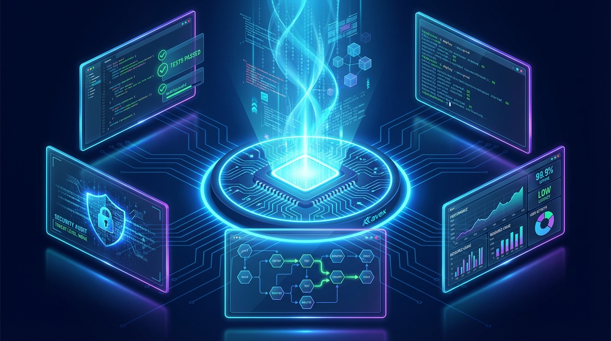
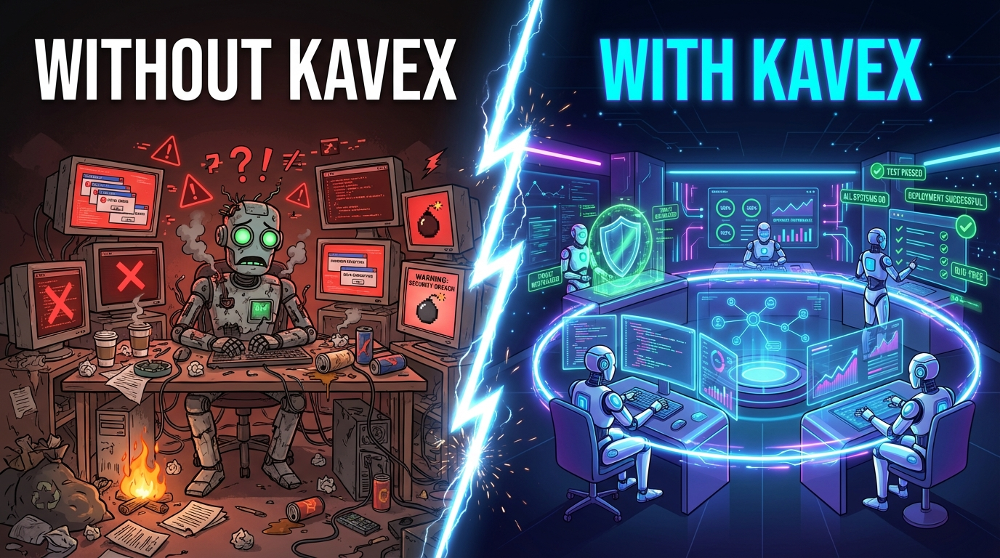
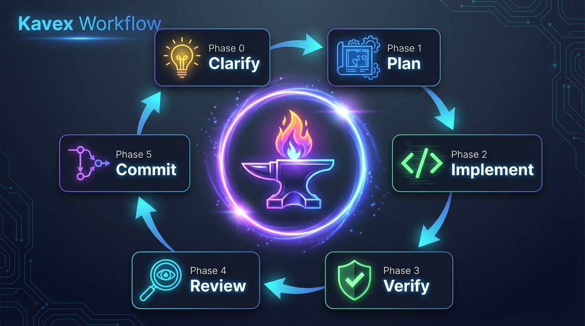
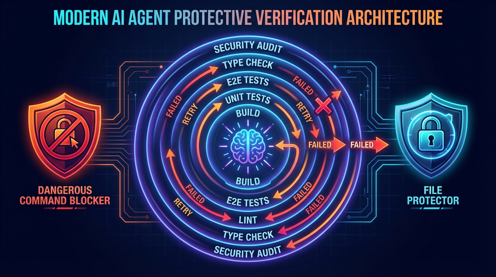

# Kavex

<p align="center">
  
</p>

<p align="center">
  <a href="LICENSE"></a>
  <a href="https://www.gnu.org/software/bash/"></a>
  <a href="https://docs.anthropic.com/en/docs/claude-code"></a>
  <a href="https://github.com/ChiFungHillmanChan/kavex/actions/workflows/ci.yml"></a>
  <a href="https://docs.anthropic.com/en/docs/claude-code"></a>
  <a href="#documentation"></a>
</p>

<h3 align="center">Safety guardrails for AI coding agents.<br/>Block dangerous commands. Verify every change. Ship with confidence.</h3>

<p align="center">
  <em>Your AI agent tried <code>rm -rf /</code> to "clean build artifacts." Kavex blocked it. You didn't even notice.</em>
</p>

<!-- TODO: Replace with actual gif after running: vhs demo/demo.tape -->
<p align="center">
  
</p>

**Kavex** is an open-source safety layer that sits between AI coding agents and your system. It blocks catastrophic commands, protects secrets, and verifies every code change — so you can let AI work autonomously without babysitting.

> **"You don't trust AI. You instrument it."** — Claude is the worker. Bash is the boss.

---

## Quick Start

### Option A: Install as Claude Code Plugin (recommended)

```bash
claude /install kavex          # Lightweight: commands + skills
claude /install kavex-full     # Full suite: + hooks + enforcement
```

That's it — no cloning, no scripts. Commands and skills are available immediately.

### Option B: Legacy Install (clone + install.sh)

```bash
# Clone Kavex
git clone https://github.com/ChiFungHillmanChan/kavex.git ~/kavex

# Go to your project
cd /path/to/your/project

# Preview what will be installed
bash ~/kavex/install.sh --dry-run

# Install Kavex into this project
bash ~/kavex/install.sh
```

Optional global CLI:

```bash
# Install global CLI
bash ~/kavex/install.sh --global

# Activate hooks for this project
kavex activate

# Verify setup
kavex status
```

### Two Plugins

| Plugin | What you get |
|--------|-------------|
| **kavex** | Slash commands (`/plan`, `/verify-app`, `/code-review`, etc.) + engineering protocol skill |
| **kavex-full** | Everything in kavex + safety hooks, verification gate, auto-format, commit gate, team loop |

Choose `kavex` if you want the workflow without enforcement. Choose `kavex-full` if you want the full autonomous engineering system.

**Requirements:** [Claude Code](https://docs.anthropic.com/en/docs/claude-code), `jq` (required), `gh` (optional), [`@openai/codex`](https://www.npmjs.com/package/@openai/codex) (optional)

---

## Documentation

### Full Guides

| Language | Link |
|----------|------|
| English | [docs/en/README.md](docs/en/README.md) |
| Cantonese (粵語) | [docs/zh-hk/README.md](docs/zh-hk/README.md) |
| Simplified Chinese (简体中文) | [docs/zh-cn/README.md](docs/zh-cn/README.md) |

### Topic Guides

| Topic | Link |
|-------|------|
| tmux Guide (English) | [docs/tmux/tmux-guide-en.md](docs/tmux/tmux-guide-en.md) |
| tmux Guide (繁體中文) | [docs/tmux/tmux-guide-zh-hant.md](docs/tmux/tmux-guide-zh-hant.md) |
| tmux Guide (简体中文) | [docs/tmux/tmux-guide-zh-hans.md](docs/tmux/tmux-guide-zh-hans.md) |

### Other Resources

| Resource | Link |
|----------|------|
| Contributing | [CONTRIBUTING.md](CONTRIBUTING.md) |
| Release Notes | [RELEASE_NOTES.md](RELEASE_NOTES.md) |
| License | [MIT](LICENSE) |

---

## The Problem

AI coding agents are powerful enough to write production code — and powerful enough to destroy production systems. Most setups have **zero guardrails** between "AI suggests command" and "command executes."

| Without Kavex | With Kavex |
|---------------|------------|
| AI runs `rm -rf /` to "clean artifacts" | **Blocked** before execution |
| AI edits `.env.production` "helpfully" | **Denied** — secrets protected |
| AI writes code with type errors, says "done" | **Caught** — lint + typecheck on every stop |
| AI loops forever trying random fixes | **Circuit breaker** kills it, writes report |
| You babysit every AI action | You review results, not process |

<p align="center">
  
</p>

## Why Kavex

- **Blocks before execution** — `rm -rf /`, `DROP TABLE`, `git push --force`, eval/base64 obfuscation — all caught
- **Protects secrets** — `.env`, `.pem`, credentials, API keys — AI can't touch them
- **Verifies every change** — 7-layer gate: build, test, lint, typecheck, security
- **Self-corrects** — failures trigger diagnostic + retry; 3 failures spawn a fresh self-healing session
- **Circuit breaker** — detects stuck loops, kills them, writes actionable reports
- **Works across 7 stacks** — Node.js, Python, Go, Rust, Ruby, Java, .NET (auto-detected)

---

## How It Works

<p align="center">
  
</p>

The Team Loop (`/kavex:loop`) is **bash-orchestrated** — Claude is the worker, bash is the boss:

```
  ┌─────────────────────────────────────────────┐
  │           kavex-loop.sh (bash)               │
  │  Controls flow, runs verification, reviews  │
  └──────────────────┬──────────────────────────┘
                     │
    For each PRD item:
                     │
       ┌─────────────▼─────────────┐
       │   claude -p (implement)   │  ← Separate session per iteration
       └─────────────┬─────────────┘
                     │
       ┌─────────────▼─────────────┐
       │  verify-gate.sh (bash)    │  ← Build, test, lint, typecheck
       │  Claude CANNOT skip this  │
       └─────────────┬─────────────┘
                     │
              pass?──┤
              │      │ fail → diagnostic prompt → retry
              ▼
       ┌─────────────────────────────┐
       │  run-code-review.sh (bash)  │  ← Separate claude -p session
       └─────────────┬───────────────┘
                     │
              pass?──┤
              │      │ HIGH issues → fix prompt → retry
              ▼
       ┌─────────────────────────────┐
       │  git commit (bash)          │
       └─────────────────────────────┘
```

**Why bash orchestration?** Prompt-based self-orchestration can be skipped. When bash runs verification _after_ Claude exits, skipping is impossible.

---

## Key Commands

### CLI (zero tokens — runs in your terminal)

```bash
kavex help          # Show all commands
kavex status        # Check hooks, stack, installed commands
kavex activate      # Turn ON hooks
kavex deactivate    # Turn OFF hooks
```

### Slash Commands (inside Claude Code)

| Command | What it does |
|---------|-------------|
| `/plan` | Plan before coding — Claude waits for your "go" |
| `/verify-app` | Full 10-layer QA sweep |
| `/commit-push-pr` | Stage, commit, push, open draft PR |
| `/fix-and-verify` | Autonomous bug fixing loop |
| `/code-review` | 4 parallel reviewers + optional Codex review |
| `/simplify` | Clean up code without changing behavior |
| `/daily-standup` | Engineering report: shipped, blockers, priorities |
| `/kavex:loop <prd>` | Team Loop: implement each PRD item autonomously |
| `/kavex:plan` | Interactive planning with clarifying questions |
| `/kavex:init` | Scaffold a new PRD file |

---

## Core Features

<p align="center">
  
</p>

| Feature | Description |
|---------|-------------|
| **Safety Hooks** | Blocks dangerous commands and protects sensitive files |
| **Fast Stop Gate** | Lint + typecheck on every stop; full 7-layer verification in Team Loop |
| **Auto-Format** | Formats code on every write (Prettier, Ruff, gofmt, rustfmt, etc.) |
| **Team Loop** | Bash-orchestrated cycle per PRD item (implement → verify → review → commit) |
| **Self-Healing** | After 3 failures, writes `DEBUG_LOG.md` and spawns a fresh session |
| **Multi-Model Review** | Claude agents + optional OpenAI Codex cross-model review |
| **Circuit Breaker** | Detects stuck loops and writes actionable failure reports |
| **Rate Limiting** | Prevents runaway API invocations |
| **tmux Dashboard** | Live monitoring via `kavex-monitor` |
| **Resumable Loops** | State saved in `.kavex-loop/` — resume after interruption |
| **Status Line** | Shows `[KAVEX]`, `[KAVEX LOOP]`, or `[kavex off]` in Claude Code |

### What Runs Where

| Check | Stop hook | Team Loop | Commit gate |
|-------|-----------|-----------|-------------|
| Build | — | Yes | — |
| Tests | — | Yes | — |
| Lint | Yes | Yes | — |
| Type check | Yes | Yes | — |
| Security | — | Warn only | — |
| Verification proof | — | — | Blocks without pass |

See the [full guide](docs/en/README.md) for detailed explanations of each feature.

---

## Testing

Automated tests across three suites:

```bash
npm install     # Install test dependencies
npm test        # Run all tests
npm run lint    # ShellCheck all scripts
```

CI runs on both Linux and macOS for every PR. See [CONTRIBUTING.md](CONTRIBUTING.md) for details.

---

## Philosophy

> "You don't trust; you instrument."

The goal isn't to hope Claude does the right thing. It's to build a system where **hooks make the wrong thing hard.** As AI models get stronger, your system gets stronger automatically.

---

## Current Guarantees and Limits

**What hooks guarantee (when active):**
- Every stop triggers lint + typecheck (fast stop gate)
- Every file write is checked against the protected files list
- Every bash command is checked against the dangerous commands list
- The Team Loop runs full 7-layer verification via bash instead of relying on prompt compliance

**What hooks do NOT guarantee:**
- Hooks can be disabled by the user (`kavex deactivate` or editing settings.json)
- The stop gate runs lint + typecheck only — build, tests, and security run in the Team Loop
- File protection uses pattern matching, not OS-level permissions
- Hooks require `jq` to be installed; without it, hooks **block** operations (fail-closed) for safety
